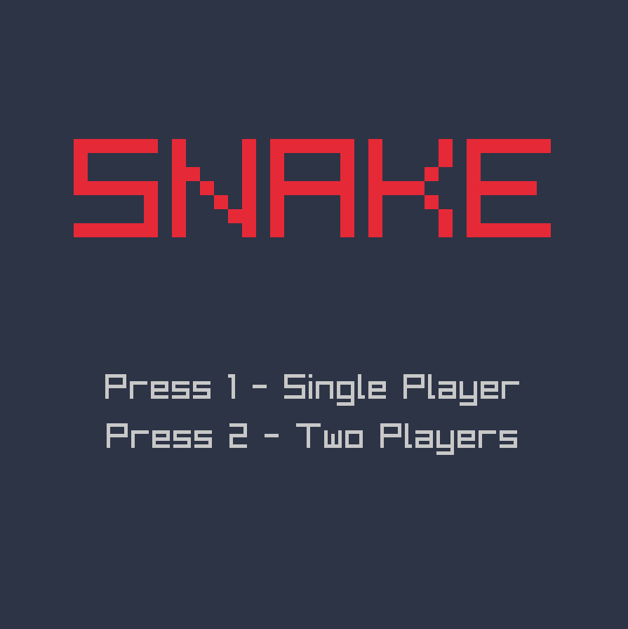
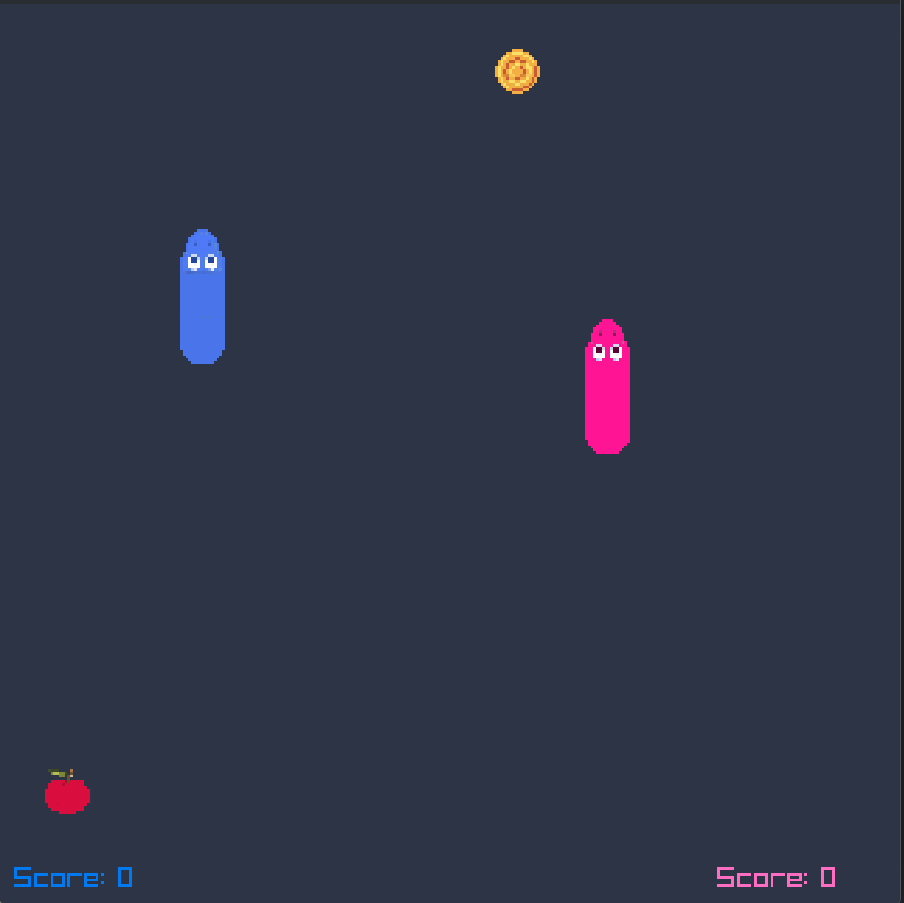

# Snake Game

A fun Snake game written in Odin using aylib. With single player and double player game modes.

## Screenshots

### Menu



### Single Player


### Double Player



## How to play

Clone the repository:

```sh
git clone https://github.com/MelchizedekShah/SnakeGame.git
```

Enter the project directory:

```sh
cd SnakeGame
```

Build the game:

```sh
odin build .
```

Run the executable:
```sh
./SnakeGame
```


